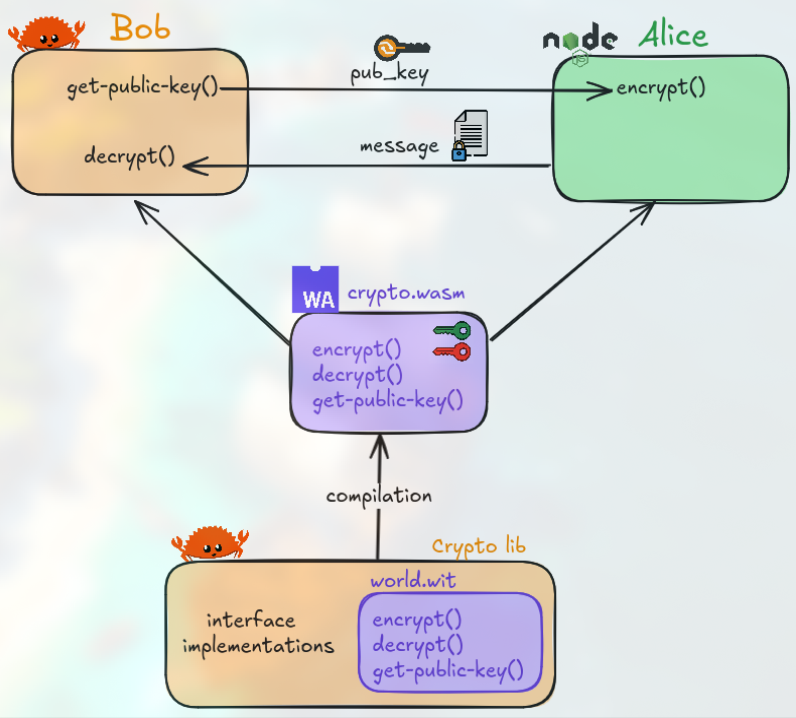

# RSA Encryption Project



This project implements a WebAssembly-based RSA encryption system with two parties: Alice (sender) and Bob (receiver). The project demonstrates secure communication using RSA encryption in a WebAssembly environment.

## Project Structure

```
.
├── alice/               # Alice's implementation (sender)
│   ├── crypto.wasm     # WebAssembly module
│   ├── index.js        # Main JavaScript file
│   ├── network.js      # Network communication
│   └── package.json    # Node.js dependencies
├── bob/                # Bob's implementation (receiver)
│   ├── crypto.wasm     # WebAssembly module
│   ├── src/           # Rust source code
│   └── Cargo.toml     # Rust dependencies
└── crypto/             # Shared crypto implementation
    ├── src/           # Rust source code
    ├── wit/           # WebAssembly Interface Types
    └── Cargo.toml     # Rust dependencies
```

## Prerequisites

- Rust (latest stable version)
- Node.js (latest LTS version)
- npm (comes with Node.js)
- WebAssembly tools (wit-bindgen)

## Installation

1. Install dependencies for bob:
```bash
rustup target add wasm32-wasip2
```

2. Install dependencies for Alice:
```bash
cd alice
npm install
```

3. Build the WebAssembly modules:
```bash
cd ../crypto
cargo build --release --target=wasm32-wasip2    
cp target/wasm32-wasip2/release/crypto.wasm ../alice/
cp target/wasm32-wasip2/release/crypto.wasm ../bob/
```

## Running the Project

1. Start Bob's server (receiver):
```bash
cd bob
cargo run --release
```

2. In a new terminal, start Alice's client (sender):
```bash
cd alice
npm start
```

## How It Works

1. **Key Generation**: Bob generates a public/private key pair using RSA.
2. **Encryption**: Alice uses Bob's public key to encrypt messages.
3. **Decryption**: Bob uses his private key to decrypt the messages.

The communication happens through a local network interface, with Bob acting as a server and Alice as a client.

## Security Considerations

- The private key is never transmitted and remains secure on Bob's side
- All communication is encrypted using RSA
- The WebAssembly implementation provides additional security through memory isolation

## Dependencies

### Rust Dependencies (crypto/)
- wit-bindgen-rt: WebAssembly Interface Types runtime
- rsa: RSA encryption implementation
- rand: Random number generation

### Node.js Dependencies (alice/)
- @bytecodealliance/jco: WebAssembly runtime for JavaScript

## Troubleshooting

1. If you encounter WebAssembly loading issues:
   - Ensure all .wasm files are properly built and copied
   - Check that the WebAssembly runtime is properly initialized

2. If you encounter network issues:
   - Verify that Bob's server is running before starting Alice
   - Check that the ports are not blocked by your firewall

## Contributing

1. Fork the repository
2. Create your feature branch
3. Commit your changes
4. Push to the branch
5. Create a new Pull Request

## License

This project is licensed under the MIT License - see the LICENSE file for details. 