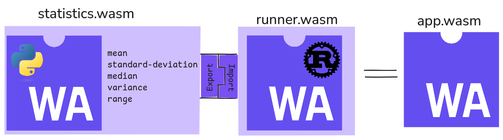

## Objetivo

Entender o modelode componentes do WebAssembly através de uma demo sobre métodos estatísticos.

## Descrição



A pasta **component/** contém código python que define e implementa as funções do componente statistics.  
A pasta **runner/** contém código rust que é responsável por fazer a entrada e saída  do programa, enquanto usa o componente statistics como backend.

## Atividade prática

1. Compile o componente
    ```bash
    make statistics.wasm
    ```

2. Compile o executor (runner)
    ```bash
    make runner.wasm
    ```

3. Conecte os componentes anteriores
    ```bash
    make app.wasm
    ```

3. Execute a aplicação
    ```bash
    wasmtime app.wasm
    ```